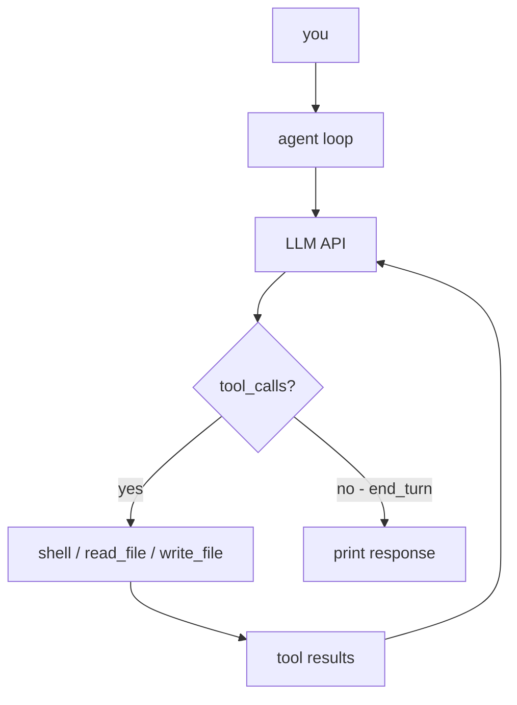

# nano-code

<div align="center">

**The smallest practical coding agent in Rust**  
Single binary • ~185 LOC • blocking HTTP • no framework ceremony


</div>

---

## ✨ Why nano-code

- **Tiny by design**: nearly everything lives in `src/main.rs`
- **Action-first agent behavior**: built to execute, not narrate
- **OpenAI-compatible API**: works with OpenRouter or any compatible `/chat/completions` endpoint
- **Easy to extend**: add a tool in two spots (`call_api()` + `dispatch()`)

---

## 🧠 How it works



### Core runtime pieces

1. **`load_env()`**  
   Reads `.env` on startup and sets environment variables (manual parser, no dotenv crate).

2. **`call_api()`**  
   Sends full conversation history to an OpenAI-compatible `/chat/completions` endpoint and registers 3 tools: `shell`, `read_file`, `write_file`.

3. **`main()` agent loop**  
   - Outer loop: reads your prompt and appends a `user` message.
   - Inner loop: calls model → executes tool calls → appends `tool` messages → repeats until end turn.

---

## ⚙️ Executor-mode behavior

The system prompt explicitly pushes the model to execute work:

> "Never describe what you would do. Do it."  
> "When asked to build something: create the files, run them, fix errors, confirm success."

---

## 📨 Message flow (OpenAI format)

```text
user:      { role: "user",      content: "your prompt" }
assistant: { role: "assistant", tool_calls: [{id, function: {name, arguments}}] }
tool:      { role: "tool",      tool_call_id: id, content: "cmd output" }
assistant: { role: "assistant", content: "final answer" }
```

The model decides when to call tools and when to stop.

---

## Quick start

### 1) Install Rust and clone

```bash
curl --proto '=https' --tlsv1.2 -sSf https://sh.rustup.rs | sh
source $HOME/.cargo/env

git clone https://github.com/Engineering4AI/nano-code
cd nano-code
```

### 2) Configure environment

```bash
cp .env.example .env
# edit .env with your API key
```

### 3) Run

```bash
cargo run
```

### 4) Build release binary

```bash
cargo build --release
./target/release/nano-code
```

---

## 🔧 Configuration (`.env`)

| Variable | Default | Description |
|---|---|---|
| `OPENROUTER_API_KEY` | required | API key |
| `INFERENCE_BASE_URL` | `https://openrouter.ai/api/v1` | Any OpenAI-compatible base URL |
| `MODEL_NAME` | `anthropic/claude-sonnet-4-6` | Model identifier |

---

## 📦 Dependencies

| Crate | Purpose |
|---|---|
| `reqwest` (blocking) | HTTP client |
| `serde` + `serde_json` | JSON serialization |

No additional framework layers.

---

## 🔗 See also

- [mini-swe-agent](https://github.com/SWE-agent/mini-swe-agent) — Python alternative

---

## 📚 Citation

If you use nano-code in research, please cite:

```bibtex
@software{nano_code2026,
  title  = {nano-code: The Smallest Possible Coding Agent in Rust},
  author = {{Engineering4AI}},
  year   = {2026},
  url    = {https://github.com/Engineering4AI/nano-code}
}
```
