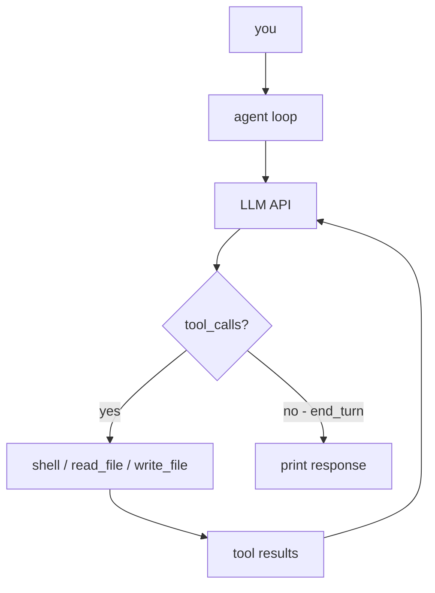

# nano-code

The smallest possible coding agent in Rust. ~185 LOC, single binary, zero fluff.

## How it works



### Three moving parts

**1. `load_env()`** — reads `.env` on startup, sets env vars. No crate needed.

**2. `call_api()`** — POST to any OpenAI-compatible `/chat/completions` endpoint with three tools registered: `shell`, `read_file`, `write_file`. Sends the full conversation history each turn.

**3. `main()` agent loop** — two nested loops:
- Outer: reads your prompt, appends as `user` message, enters inner loop.
- Inner: calls API → if `finish_reason == "tool_calls"`, executes each tool and appends `tool` result messages, then calls API again. Breaks when `finish_reason == "end_turn"` (or anything else).

### Executor-mode system prompt

The agent is instructed to act, not describe:

> "Never describe what you would do. Do it."
> "When asked to build something: create the files, run them, fix errors, confirm success."

### Message flow (OpenAI format)

```
user:      { role: "user",      content: "your prompt" }
assistant: { role: "assistant", tool_calls: [{id, function: {name, arguments}}] }
tool:      { role: "tool",      tool_call_id: id, content: "cmd output" }
assistant: { role: "assistant", content: "final answer" }
```

The model decides when to run tools and when to stop. You just provide the goal.

## Setup

```bash
cp .env.example .env
# edit .env with your key
cargo run
```

## Configuration (`.env`)

| Variable | Default | Description |
|---|---|---|
| `OPENROUTER_API_KEY` | required | API key |
| `INFERENCE_BASE_URL` | `https://openrouter.ai/api/v1` | Any OpenAI-compatible base URL |
| `MODEL_NAME` | `anthropic/claude-sonnet-4-6` | Model identifier |

## Build

```bash
cargo build --release
./target/release/nano-code
```

## Dependencies

| Crate | Purpose |
|---|---|
| `reqwest` (blocking) | HTTP client |
| `serde` + `serde_json` | JSON serialization |

Nothing else.
